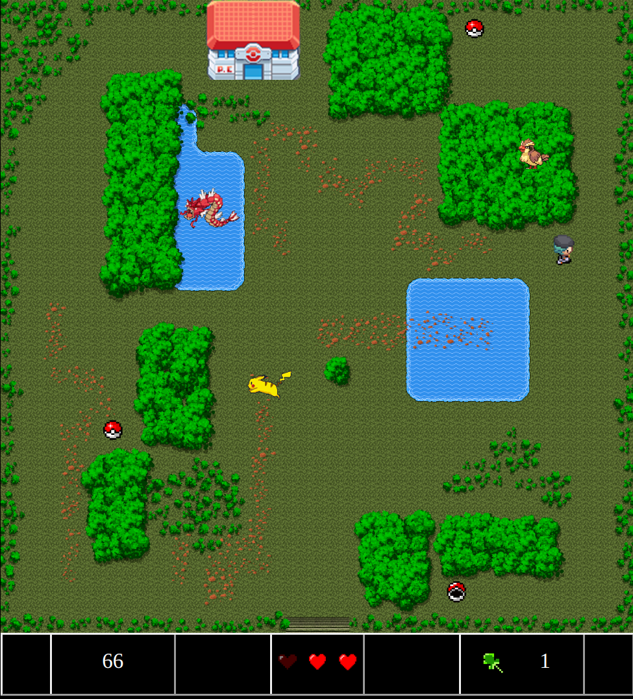

# Pikachu's Adventure: A Zelda-Inspired Game

Pikachu's Adventure is a game inspired by The Legend of Zelda (NES) and set in a Pokemon environment. The objective of the game is to find a badge hidden in one of three Pokeball chests on the map and then make it to the Pokemon Center within one minute to win.

## Gameplay

The game is played from a top-down perspective, similar to The Legend of Zelda. You control Pikachu using either the arrow keys or the WASD keys to move around the map. The objective is to search for the badge hidden in one of three Pokeball chests scattered throughout the map. Once you have found the badge, a Pokemon Center will appear on the map.

You must make it to the Pokemon Center within one minute to win the game. If you fail to find the badge within one minute or fail to make it to the Pokemon Center in time, you will lose the game.

## Installation

To play Pikachu's Adventure, follow these steps:

1. Clone the repository to your local machine
2. Open the index.html file in your browser
3. Start playing the game!

## Authors

Pikachu's Adventure was created by:

- Carolina (https://github.com/gcarolina03)
- Ariadna (https://github.com/Ariadnads)
- Juan (https://github.com/JB-Aguilar)

## Technologies Used

This project was built using:

- HTML
- CSS
- JavaScript

## Contributing

If you would like to contribute to Pikachu's Adventure, please submit a pull request with your changes. We welcome contributions of all kinds, including bug fixes, feature additions, and general improvements.

## Project Link

You can find the project on GitHub at: https://github.com/gcarolina03/pikachusAdventure

## License

This project is licensed under the [MIT License](LICENSE).
